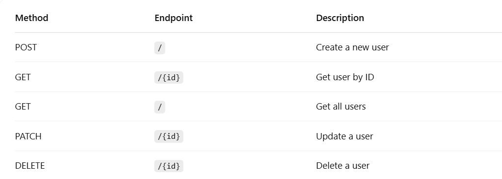
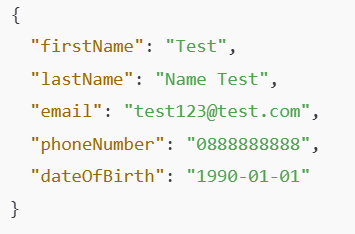
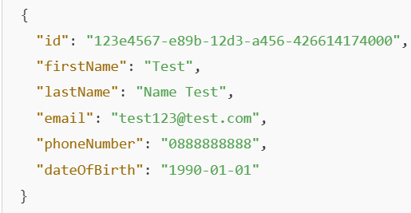
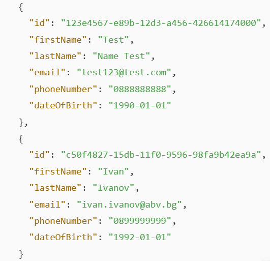
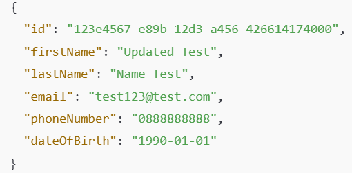
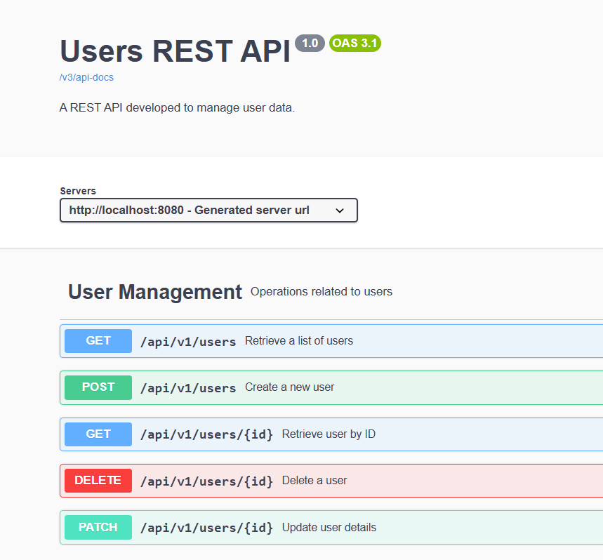

# 🧾 user_svc - User Management REST API

A simple Spring Boot 3-based RESTful API to manage users, with full CRUD functionality and MySQL database integration. This project uses Liquibase for database migrations and Swagger for API documentation.

---

## 🚀 Tech Stack

- **Java 21**
- **Spring Boot 3**
- **Spring Security**
- **MySQL**
- **Liquibase**
- **Lombok**
- **Springdoc OpenAPI (Swagger)**
- **Maven**

1. **Clone the repository (Or download its zip file):**

-https://github.com/TsvetanTodorov/user-svc.git

The project itself uses Liquibase for managing database schema changes.
The initial changelog includes the creation of the user table and inserts 3 
default users for testing purposes.
- **All three users have the same encoded password "123123" to be used for testing**

🌐 API Endpoints

Create User

- **This endpoint allows you to create a new user without any authentication**

/api/v1/users

Get User by ID

- **This endpoint allows you to retrieve information about a user by their ID. However, authentication is required, and you must provide valid credentials (email and password) to access this data.**

/api/v1/users/123e4567-e89b-12d3-a456-426614174000

GET Users

- **This endpoint allows you to retrieve information about all users. However, authentication is required, and you must provide valid credentials (email and password) to access this data.**

/api/v1/users

Update User 

- **This endpoint allows you to update a user's details. You can update any field (or all fields) of the user. However, authentication is required, and you must provide valid credentials (email and password) to access this data.**

/api/v1/users/123e4567-e89b-12d3-a456-426614174000

Delete User

- **This endpoint allows you to delete user by ID. However, authentication is required, and you must provide valid credentials (email and password) to access this data.**
- **!!! NOTHING IS RETURNED IF THE USER WAS SUCCESSFULLY DELETED !!!**

API documentation via Swagger
- **If authentication is needed, can be logged via using one of the users email and password**
- 