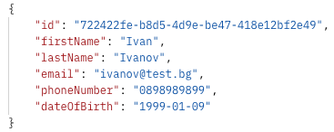

# 🧾 user_svc - User Management REST API

A simple Spring Boot 3-based RESTful API to manage users, with full CRUD functionality and MySQL database integration.
This project uses Liquibase for database migrations and Swagger for API documentation.

---

## 🚀 Tech Stack

- **Java 21**
- **Spring Boot 3**
- **MySQL**
- **Liquibase**
- **Lombok**
- **Springdoc OpenAPI (Swagger)**
- **Maven**

1. **Clone the repository (Or download its zip file):**

- https://github.com/TsvetanTodorov/user-svc.git

The project itself uses Liquibase for managing database schema changes.
The initial changelog includes the creation of the user table and inserts 3
default users for testing purposes.

---

## 🌐 API Endpoints

---

## 🚀 Create User

- **This endpoint allows you to create a new user.**
- **The expected structure of the JSON request body is as follows:**
- /api/v1/users
- ## 📥 Request Format

- **The expected format of the JSON response is as shown below:**
- ## 📤 Response Format

---

## 🔍 Get User by ID

- **This endpoint allows you to retrieve information about a user by their ID.**
- **This endpoint expects a user ID to be provided as a path variable, as shown below:**
- /api/v1/users/{id}
- ## 📥 Request Format

- **The expected format of the JSON response is as shown below:**
- ## 📤 Response Format

---

## 📄 GET Users

- **This endpoint retrieves information for all users, sorted by last name and date of birth. An optional search term
  may be provided to filter users whose last names contain the specified keyword.**
- **The expected structure of the JSON request body is as follows:**
- /api/v1/users
- ## 📥 Request Format

- ## 📤 Response Format

---

## 💾 Update User

- **This endpoint allows you to update a user's details. You can update any field (or all fields) of the user.**
- **The JSON request body may contain one or more of the following fields. Only the fields provided will be updated**
  -/api/v1/users/{id}

- ## 📥 Request Format

- ## 📤 Response Format

---

## 🗑️ Delete User

- **This endpoint allows you to delete user by ID.**
- **Upon successfully processing the following request:**
-/api/v1/users/{id}

- ## 📥 Request Format

- ## 📤 Response Format
- **The server returns a 200 OK status code, indicating that the user was successfully deleted.
  No content is returned in the response body.**

---

## 📖 API Documentation via Swagger

